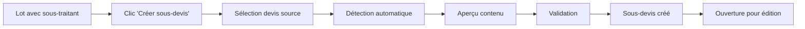

# 🔀 Système de Création de Sous-devis par Lot

## 📋 Vue d'ensemble

Le module `construction_base` intègre un système **simple et ergonomique** de création de sous-devis qui permet de générer directement un sous-devis pour un lot spécifique en cliquant simplement sur le lot et en sélectionnant le devis source.

## 🎯 Fonctionnalité Principale

### **Création Directe de Sous-devis par Lot**
- 🖱️ **Clic direct** : Cliquer sur "📋 Créer sous-devis" dans la ligne du lot
- 🔍 **Détection automatique** : Le système détecte automatiquement les sections et articles du devis correspondant au lot
- 👷 **Assignation automatique** : Le sous-devis est créé pour le sous-traitant assigné au lot
- 📋 **Aperçu en temps réel** : Prévisualisation du contenu qui sera extrait

## 🚀 Comment utiliser le système

### **Flux Utilisateur Ultra-Simple :**

```
1. 🏗️ Ouvrir l'onglet "Lots de travaux" du chantier
2. 🖱️ Cliquer sur "📋 Créer sous-devis" pour le lot désiré
3. 📋 Sélectionner le devis principal source
4. 👁️ Prévisualiser le contenu détecté automatiquement
5. ✅ Valider la création du sous-devis
6. 📄 Le sous-devis s'ouvre automatiquement
```

### **Exemple Concret :**

```
Chantier : "Rénovation Villa Dupont"
Lot : "Électricité" (assigné à SARL Électro+)
Devis principal : DEV001 (150 000€)

Action : Clic "📋 Créer sous-devis" sur la ligne "Électricité"

Résultat automatique :
✅ Détection de la section "⚡ Électricité" dans DEV001
✅ Extraction de 8 lignes produits (câbles, prises, tableau...)
✅ Calcul automatique : 35 000€
✅ Création du sous-devis assigné à SARL Électro+
✅ Ouverture immédiate pour édition/validation
```

## 🔧 Fonctionnalités Techniques

### **Détection Intelligente du Contenu**
Le système analyse le devis principal et identifie automatiquement :

1. **Sections nommées** : Sections contenant le nom ou code du lot
2. **Produits par catégorie** : Articles correspondant aux mots-clés du lot
3. **Lignes de notes** : Commentaires et spécifications techniques
4. **Calcul des montants** : Total automatique des éléments extraits

### **Logique de Correspondance**
```python
# Identification par section
"📋 Électricité" → Lot "Électricité"
"🔌 Installation électrique" → Lot "Électricité"

# Identification par produits
"Câble 2.5mm" → Lot "Électricité"
"Interrupteur" → Lot "Électricité"
"Carrelage" → Lot "Carrelage"
```

### **Structure du Sous-devis Généré**
- **En-tête** : Informations du chantier et du lot
- **Destinataire** : Sous-traitant assigné au lot
- **Contenu** : Sections et produits extraits automatiquement
- **Origine** : Référence au devis principal
- **Statut** : Brouillon pour permettre les ajustements

## 📊 **Interface Utilisateur**

### **Vue Liste des Lots (Améliorée)**
```
| Nom         | Code | Prix    | Terminé | Sous-traitants | Action          |
|-------------|------|---------|---------|----------------|-----------------|
| Électricité | ELEC | 35000€  | ❌      | SARL Électro+  | 📋 Créer sous-devis |
| Plomberie   | PLOM | 28000€  | ❌      | Plomberie Pro  | 📋 Créer sous-devis |
| Peinture    | PEIN | 15000€  | ✅      | Artisan Color  | 📋 Créer sous-devis |
```

### **Wizard de Création**
- **Sélection du devis** : Liste des devis confirmés du chantier
- **Aperçu automatique** : Tableau des éléments détectés
- **Montant estimé** : Calcul en temps réel
- **Validation** : Création immédiate du sous-devis

## 🎯 **Avantages de cette Approche**

### **Simplicité d'Usage**
- **1 clic** pour créer un sous-devis
- **Aucune configuration** préalable complexe
- **Interface intuitive** directement dans les lots

### **Efficacité**
- **Détection automatique** du contenu pertinent
- **Pas de sélection manuelle** ligne par ligne
- **Création instantanée** du sous-devis

### **Flexibilité**
- **Ajustements possibles** après création
- **Multiple devis sources** possibles
- **Édition complète** du sous-devis généré

## 🔍 **Exemples d'Utilisation**

### **Cas 1 : Rénovation avec Sections Organisées**
```
Devis principal structuré :
📋 Gros Œuvre
  • Démolition cloison
  • Création ouverture

📋 Électricité  
  • Câblage tableau
  • Prises et interrupteurs

📋 Peinture
  • Enduit rebouchage
  • Peinture blanche

→ Clic sur lot "Électricité" = Sous-devis avec section complète
```

### **Cas 2 : Devis Non-Structuré**
```
Devis avec produits mélangés :
• Câble électrique 2.5mm
• Carrelage blanc 30x30
• Interrupteur simple
• Colle à carrelage
• Tableau électrique

→ Clic sur lot "Électricité" = Détection des produits électriques uniquement
```

## ⚡ **Prérequis et Conditions**

### **Prérequis Simples**
- Lot avec **sous-traitant assigné**
- **Devis confirmé** sur le chantier
- Devis **contenant le lot** sélectionné

### **Gestion des Erreurs**
- **Pas de sous-traitant** → Message d'aide pour en assigner un
- **Pas de devis** → Information sur les prérequis
- **Contenu non détecté** → Suggestion d'organisation du devis

## 🔄 **Workflow Complet**



## 📈 **Évolutions Futures**

### **Version 1.1 (Prévue)**
- **IA de détection** : Amélioration de la reconnaissance de contenu
- **Templates de lots** : Modèles prédéfinis par métier
- **Règles personnalisées** : Configuration de la détection

### **Version 1.2 (Prévue)**
- **Gestion multi-devis** : Extraction depuis plusieurs devis
- **Notifications automatiques** : Envoi aux sous-traitants
- **Intégration mobile** : App dédiée pour les sous-traitants

---

## 📞 **Support Technique**

- 📧 **Support** : support@blggroupe.com
- 📖 **Documentation** : Module `construction_base`
- 🎯 **Formation** : Demander une démonstration

Le système est maintenant **ultra-simplifié** : **1 clic → 1 sous-devis** ! 🚀 