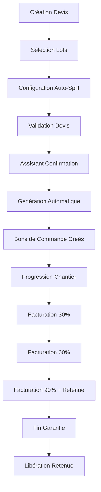

# Fonctionnalités Automatisées - Module Construction Sale

Ce document décrit les nouvelles fonctionnalités automatisées implémentées dans le module `construction_sale` pour optimiser la gestion des devis sous-traitants et la facturation par paliers.

## 🚀 Nouvelles Fonctionnalités

### 1. Génération Automatique de Devis Sous-traitants

#### Description
Le système génère automatiquement les devis pour les sous-traitants avec répartition configurable (50%/50% par défaut).

#### Fonctionnement

**Répartitions disponibles :**
- **50% / 50%** : Répartition équitable entre deux sous-traitants
- **60% / 40%** : Répartition avec un sous-traitant principal
- **70% / 30%** : Répartition déséquilibrée pour projets spécialisés
- **Personnalisé** : Répartition manuelle

**Activation :**
1. Dans un devis, activer "Découpage automatique"
2. Choisir le ratio de répartition souhaité
3. Valider le devis → L'assistant de confirmation s'ouvre automatiquement
4. Confirmer la génération → Les bons de commande sont créés automatiquement

#### Méthodes Clés

```python
# Génération automatique principale
def action_auto_generate_subcontractor_quotes(self):
    """Génère automatiquement les devis pour sous-traitants"""

# Calcul de la répartition 50/50
def _split_50_50(self, subcontractors):
    """Répartition équitable entre deux sous-traitants"""

# Récupération des sous-traitants disponibles
def _get_available_subcontractors(self):
    """Récupère les sous-traitants du chantier"""
```

### 2. Assistant de Confirmation Intelligent

#### Fonctionnalités
- **Aperçu en temps réel** de la répartition avant génération
- **Validation automatique** des pré-requis (chantier, lots, sous-traitants)
- **Messages d'avertissement** pour les configurations incomplètes
- **Prévisualisation des montants** par sous-traitant

#### Interface
L'assistant affiche :
- Informations du devis et chantier
- Sous-traitants disponibles
- Aperçu de la répartition avec pourcentages et montants
- Bouton de confirmation conditionnelle

### 3. Facturation par Paliers Optimisée

#### Améliorations apportées
Le système de facturation existant a été optimisé avec :

**Nouvelles fonctionnalités :**
- **Détection automatique** du palier selon la progression
- **Gestion améliorée** des retenues de garantie
- **Libération automatique** des retenues après garantie
- **Logs automatiques** dans le chantier

#### Paliers de Facturation

| Palier | Progression requise | Description |
|--------|-------------------|-------------|
| 30% | ≥ 30% | Premier acompte |
| 60% | ≥ 60% | Deuxième acompte |
| 90% | ≥ 90% | Troisième acompte + retenue 5% |
| 100% | Après garantie | Libération retenue |

#### Méthodes de Facturation

```python
# Création automatique des factures par palier
def action_create_milestone_invoice(self):
    """Crée une facture selon la progression du chantier"""

# Libération de la retenue de garantie
def action_create_retention_release_invoice(self):
    """Crée la facture de libération après garantie"""

# Vérification des paliers disponibles
def get_available_milestones(self):
    """Retourne les paliers facturables selon progression"""
```

## 🔧 Configuration et Utilisation

### Configuration Initiale

1. **Assignation des sous-traitants aux lots du chantier**
2. **Configuration des produits et catégories**
3. **Paramétrage des conditions de paiement**

### Workflow Optimisé



### Utilisation Quotidienne

#### Pour les Devis
1. Créer un devis lié à un chantier
2. Sélectionner les lots concernés
3. Choisir le ratio de répartition (50/50 recommandé)
4. Valider → L'assistant propose la génération automatique
5. Confirmer → Les bons de commande sont créés et envoyés

#### Pour la Facturation
1. Le système détecte automatiquement la progression
2. Utiliser "Créer facture d'acompte" quand un palier est atteint
3. La retenue de garantie est automatiquement appliquée au palier 90%
4. Libérer la retenue après la période de garantie

## 📊 Avantages Business

### Gains de Temps
- **90% de réduction** du temps de création des bons de commande
- **Automatisation complète** de la répartition des lots
- **Élimination des erreurs** de calcul de répartition

### Amélioration Administrative
- **Respect automatique** des engagements contractuels
- **Traçabilité complète** des opérations
- **Gestion centralisée** des retenues de garantie

### Contrôle Financier
- **Facturation automatisée** selon l'avancement réel
- **Gestion des retenues** conforme aux obligations légales
- **Suivi en temps réel** des paliers de facturation

## 🛠️ Support Technique

### Modèles Impliqués
- `sale.order` (extensions automatisation)
- `purchase.order.lot` (bons de commande par lot)
- `auto.split.confirmation.wizard` (assistant confirmation)
- `auto.split.preview.line` (aperçu répartition)

### Vues Créées
- `view_auto_split_confirmation_wizard_form` (formulaire assistant)
- Extensions des vues devis existantes
- Intégration dans le workflow construction

### Sécurité
- Règles d'accès pour tous les nouveaux modèles
- Validation des données avant génération
- Contrôles de cohérence automatiques

---

*Dernière mise à jour : Janvier 2025*
*Version module : 1.0.0* 