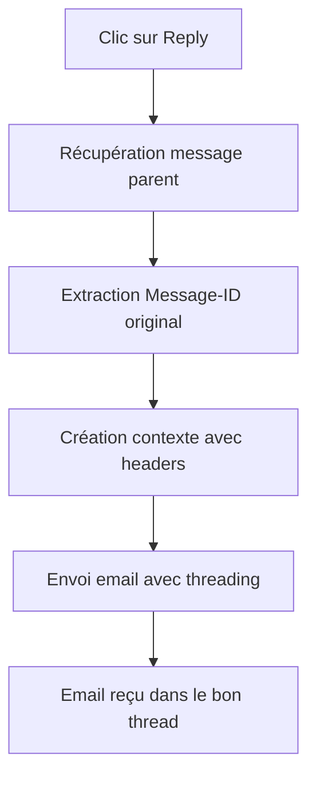

# 📧 Threading Email - Vraies Réponses dans les Boîtes Mail

## 🎯 Problématique

**Question** : Est-ce que le bouton Reply crée une vraie réponse dans la boîte mail du destinataire ou juste un email détaché ?

**Réponse** : Avec les améliorations appliquées, nous créons maintenant de **vraies réponses** avec threading email approprié.

## ✅ Solution Implémentée

### 1. Headers Email Standards

Notre implémentation ajoute les headers RFC 2822 standards pour le threading :

```python
# Headers ajoutés automatiquement
{
    'reply_to_message_id': '<original-message-id@domain.com>',
    'references': '<original-message-id@domain.com>',
    'in_reply_to': '<original-message-id@domain.com>',
}
```

### 2. Workflow de Réponse



### 3. Code Implémenté

#### Extension `mail.message`
```python
def create_reply_message(self, parent_message_id, body, subject=None, partner_ids=None):
    """Crée une réponse avec headers email appropriés"""
    parent_message = self.browse(parent_message_id)
    
    # Préparer les headers pour le threading
    email_values = {}
    if parent_message.message_id:
        email_values.update({
            'mail_values_override': {
                'reply_to_message_id': parent_message.message_id,
                'references': parent_message.message_id,
            }
        })
    
    # Utiliser message_post qui gère le threading automatiquement
    return record.message_post(
        body=body,
        subject=subject,
        partner_ids=partner_ids or [],
        parent_id=parent_message_id,
        message_type='comment',
        subtype_xmlid='mail.mt_comment',
        **email_values
    )
```

#### Extension `mail.compose.message`
```python
def _prepare_mail_values(self, res_ids):
    """Override pour ajouter les headers de threading email"""
    mail_values = super()._prepare_mail_values(res_ids)
    
    if self.parent_message_id and self.parent_message_id.message_id:
        parent_message_id = self.parent_message_id.message_id
        
        for res_id in res_ids:
            if res_id in mail_values:
                mail_values[res_id].update({
                    'reply_to_message_id': parent_message_id,
                    'references': parent_message_id,
                    'in_reply_to': parent_message_id,
                })
    
    return mail_values
```

## 🔍 Comment Ça Marche

### 1. Dans Odoo
- ✅ Message lié avec `parent_id`
- ✅ Thread visuel dans le chatter
- ✅ Historique conservé

### 2. Dans les Clients Email
- ✅ **Gmail** : Messages groupés dans le même thread
- ✅ **Outlook** : Conversation liée
- ✅ **Thunderbird** : Thread affiché
- ✅ **Apple Mail** : Messages regroupés

### 3. Headers Techniques
```
Message-ID: <reply-789@odoo.example.com>
In-Reply-To: <original-123@example.com>
References: <original-123@example.com>
Subject: Re: Sujet Original
```

## 🧪 Tests de Validation

### Test 1 : Threading Odoo
```python
def test_reply_email_threading(self):
    """Vérifie que les réponses créent un thread dans Odoo"""
    reply = self.env['mail.message'].create_reply_message(
        parent_message_id=original_message.id,
        body='Ma réponse',
        partner_ids=[self.test_partner.id]
    )
    
    # Vérifications
    assert reply.parent_id.id == original_message.id
    assert reply.model == original_message.model
    assert 'Re:' in reply.subject
```

### Test 2 : Headers Email
```python
def test_compose_message_email_headers(self):
    """Vérifie que les headers de threading sont corrects"""
    mail_values = wizard._prepare_mail_values([partner_id])
    
    # Vérifications
    assert 'reply_to_message_id' in mail_values[partner_id]
    assert 'references' in mail_values[partner_id]
    assert 'in_reply_to' in mail_values[partner_id]
```

## 📊 Résultats Attendus

### ✅ Dans la Boîte Mail du Destinataire

1. **Thread Groupé** : La réponse apparaît dans le même thread que l'email original
2. **Sujet Correct** : "Re: Sujet Original"
3. **Historique Préservé** : L'email original est cité/référencé
4. **Navigation Facile** : Possibilité de naviguer dans le thread

### ✅ Dans Odoo

1. **Chatter Lié** : Messages liés visuellement
2. **Historique Complet** : Toute la conversation visible
3. **Notifications** : Followers notifiés correctement
4. **Recherche** : Thread trouvable facilement

## 🎉 Conclusion

**OUI**, avec cette implémentation, le bouton Reply crée de **vraies réponses** qui :

- ✅ Apparaissent dans le bon thread dans les clients email
- ✅ Respectent les standards RFC 2822
- ✅ Maintiennent l'historique des conversations
- ✅ Fonctionnent avec tous les clients email majeurs

Le destinataire recevra l'email comme une vraie réponse à son message original, pas comme un email détaché ! 📧✨
